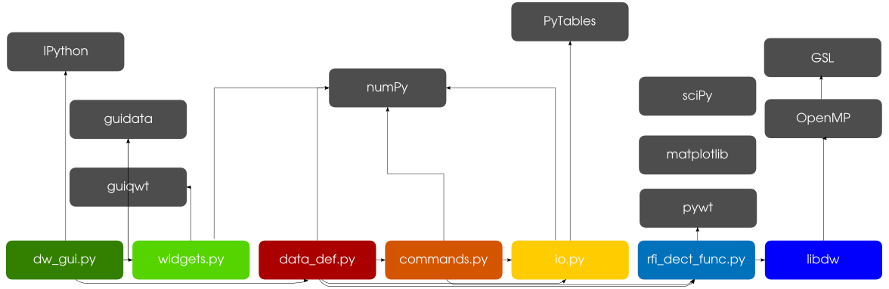

Dependencies
============

:doc:`dw.core`
--------------
* NumPy >=1.8.2 (http://www.numpy.org/)
* PyTables >=3.1.1 (http://pytables.github.io/)
* Astropy >=0.4.2 (http://astropy.org/)

:doc:`dw.gui`
-------------
* IPython >=2.3.0 (http://ipython.org/)
* guidata >=1.6.1 (https://pythonhosted.org/guidata/)
* guiqwt >=2.3.1 (https://pythonhosted.org/guiqwt/)

:doc:`dw.flag`
--------------
* SciPy >=0.14.0 (http://www.scipy.org/)
* NumPy >=1.8.2 (http://www.numpy.org/)
* Matplotlib >=1.4.2 (http://matplotlib.org/)
* PyWavelets >=0.2.2 (http://www.pybytes.com/pywavelets/)

:doc:`libdw`
-----------
* GNU Scientific Library >=1.16 (https://www.gnu.org/software/gsl/)
