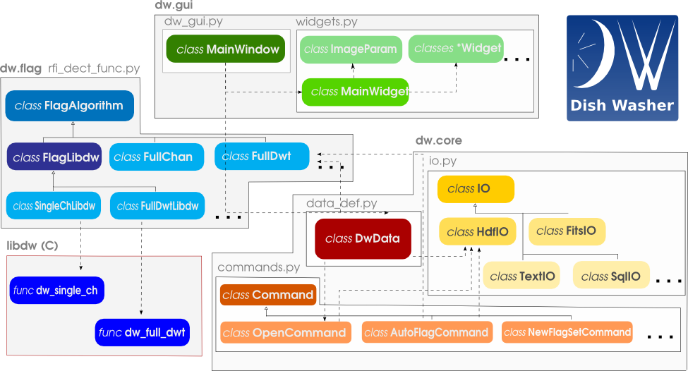

=================
Package structure
=================
The DW package is composed by 3 python sub-packages in charge of different functionalities 
and responsibilities and a C library aimed to provide efficient implementation of RFI detection algorithms. Each sub-package is in turn eventually divided in several files.

Structure of the DW package

dw subpackages
==============

* dw.core
* dw.flag
* dw.gui

:doc:`dw.core`
--------------
This package contains the implementation of the core functionalities of DW: main data structure definition, data I/O, command logging, manual flagging, 
auto flagging algorithm call.

The package implements the following classes:

* :py:class:`dw.core.data_def.DWData` (:py:mod:`dw.core.data_def`)
* :py:class:`dw.core.commands.Command` (and subclasses) (:py:mod:`dw.core.commands`)
* :py:class:`dw.core.io.DwDataSet` (:py:mod:`dw.core.io`)
* :py:class:`dw.core.io.DWIO` (and subclasses) (:py:mod:`dw.core.io`)

:py:class:`dw.core.data_def.DWData` class
~~~~~~~~~~~~~~~~~~~~~~~~~~~~~~~~~~~~~~~~~
This is the main class of the package. It implements the data structure to manage 
data, metadata, flagging matrices. It implements methods to access data files, retrieve 
data and metadata, set flagged areas. The class can access several data formats 
through the subclasses of :py:class:`dw.core.io.DWIO` class, can run automatic RFI detection algorithms 
through the subclasses of :py:class:`dw.flag.rfi_dect_func.FlagAlgorithm` class. The operation made on the data 
necessary to reconstruct the elaboration flow are executed and logged through the 
subclasses of the :py:class:`dw.core.commands.Command` class.

This class is intended also to provide, through the implemented methods, a command line 
interface to the package's functionalities to be used with an interactive python shell 
(i.e. IPython), in scripts to perform batch processing or to be imported in 
other software projects.

For further details on the use of the class methods please refer to the *user's documentation* or :py:mod:`dw.core.data_def`. 

:py:class:`dw.core.commands.Command` class
~~~~~~~~~~~~~~~~~~~~~~~~~~~~~~~~~~~~~~~~~~
Operation made on the data, basically creation, deletion, modification and merging of 
flagging matrices may have, in principle, special requirements, as operation modify the 
data file (even if they do not affect the data itself). For instance, all this kind of operation need to be 
logged for the seek of reconstructing the computation chain. :py:class:`dw.core.commands.Command` 
is the basic class involved. It takes care of calling the logging procedure and 
actual command execution. Each command is then implemented as a subclass and contain the 
actual intructions. Arguments are passed to the command constructor and stored as 
class members. The *execute* method is required and must contain the command implementation.
The execution of the command is launched after the instantiation without the need of explicit 
calling the *execute* method. As an example, the call to :py:class:`dw.core.commands.OpenCommand` 
as performed in * :py:class:`dw.core.data_def.DWData` is shown below::

    dwcomm.OpenCommand(self, file_name, file_type)
    
Commands output is written in the proper members of the class :py:class:`dw.core.data_def.DWData` instance 
launching the commands.

:py:class:`dw.core.io.DwDataSet` class
~~~~~~~~~~~~~~~~~~~~~~~~~~~~~~~~~~~~~~
*DwDataSet* is a simple data structure used to store the handle to the data set and 
some metadata such as
* number of channels
* bandwidth
* number of samples
* plot time scale values
* plot frequency time scale values

An instance of the class is allocated by the running I/O class and referenced by 
:py:class:`dw.core.data_def.DWData` class. 

Data in this structure can be file format dependent. The structure is hence always 
accesses by the proper I/O class methods.

:py:class:`dw.core.io.DWIO` class
~~~~~~~~~~~~~~~~~~~~~~~~~~~~~~~~~
This class is an interface to I/O implementations for several data file formats. 

Currently, the only implemented subclasses are :py:class:`dw.core.io.HdfIO` and :py:class:`dw.core.io.FitsIO`, providing  
access to data and metadata written in a specific format in a HDF5 file of in a Fits file and flagging data 
writing capabilities on the same file.

:py:class:`dw.core.io.HdfIO` and :py:class:`dw.core.io.FitsIO` differs for the method to save and store flag datas.
While the first saves the flagging datas in tables of the same dimension of the scientific data table, 
the second saves only the coordinates of the flags and recreate the flagging table in memory on demand.

All the :py:class:`dw.core.io.DWIO` subclasses must implement the same 
methods in order to make :py:class:`dw.core.data_def.DWData` agnostic with respect to 
the file format the data are stored in. :py:class:`dw.core.data_def.DWData` will 
instantiate the proper class (depending on the file type) and will perform data IO 
through using the same interface (those defined by :py:class:`dw.core.io.DWIO`)

In principle, I/O classes can be implemented for any kind of storage format, 
including text files, sql DBMS and so on.

:doc:`dw.flag`
--------------
This subpackage implements a small framework to ease the implementation of 
RFI detection algorithms to use with DW. It is composed by three main classes to be 
used to implement actual detection algorithms. Those algorithms can be written 
in python or, For the sake of computational efficiency, in C through the ::doc::`libdw` 
library.

The package includes the following classes:

*general classes*

* :py:class:`dw.flag.rfi_dect_func.AutoFlagSet` (:py:mod:`dw.flag.rfi_dect_func`)
* :py:class:`dw.flag.rfi_dect_func.FlagAlgorithm` (:py:mod:`dw.flag.rfi_dect_func`)
* :py:class:`dw.flag.rfi_dect_func.FlagLibDw` (:py:mod:`dw.flag.rfi_dect_func`)

*python RFI detection algorithms*

* :py:class:`dw.flag.rfi_dect_func.FullChan` (:py:mod:`dw.flag.rfi_dect_func`)
* :py:class:`dw.flag.rfi_dect_func.FullDWT` (:py:mod:`dw.flag.rfi_dect_func`)

*C RFI detection algorithms*

* :py:class:`dw.flag.rfi_dect_func.SingleChLibdw` (:py:mod:`dw.flag.rfi_dect_func`)
* :py:class:`dw.flag.rfi_dect_func.EvenOddLibdw` (:py:mod:`dw.flag.rfi_dect_func`)

:py:class:`dw.flag.rfi_dect_func.AutoFlagSet` class
~~~~~~~~~~~~~~~~~~~~~~~~~~~~~~~~~~~~~~~~~~~~~~~~~~~
This class implements a simple data structure aimed to store the output flagging 
matrices produces by the automatic RFI detection algorithms.

Class members are:

* flag_data
* algorithm
* flagresult
* param

*flag_data* is a 2D numpy array of the same shape of the input data, containing a flagging matrix.

*algorithm* is a string containing the name of the RFI detection algorithm used to produce the flagging matrix

*flagresult* is a string containing the name of the flagging matrix types

*param* is a dictionary containing the name (as dictionary keys) and  values 
(as dictionary values) of the algorithm parameters used for the calculation

:py:class:`dw.flag.rfi_dect_func.FlagAlgorithm` class
~~~~~~~~~~~~~~~~~~~~~~~~~~~~~~~~~~~~~~~~~~~~~~~~~~~~~
This is the main class of the package, all the classes implementing RFI detection 
algorithms are subclasses of it. The class provides general data structure and 
general functionalities through methods implemented here, including algorithm 
default and actual parameters setting and retrieval, output selection, available 
RFI algorithms retrieval. 

:py:class:`dw.flag.rfi_dect_func.FlagLibDw` class
~~~~~~~~~~~~~~~~~~~~~~~~~~~~~~~~~~~~~~~~~~~~~~~~~
This class extends :py:class:`dw.flag.rfi_dect_func.FlagAlgorithm`. Its aim is to 
provide an interface to the detection algorithm implemented in :doc:`libdw`. 
It overrides the methods :py:meth:`dw.flag.rfi_dect_func.FlagAlgorithm.__init__`, 
:py:meth:`dw.flag.rfi_dect_func.FlagAlgorithm._define_output` and 
:py:meth:`dw.flag.rfi_dect_func.FlagAlgorithm.compute` of :py:class:`dw.flag.rfi_dect_func.FlagAlgorithm` class 
in order to allocate a data structure with proper reference to input and output data 
suitable to be used by :doc:`libdw` and to properly call the C computing function.

Writing RFI detection algorithms (using python)
~~~~~~~~~~~~~~~~~~~~~~~~~~~~~~~~~~~~~~~~~~~~~~~
Writing a new RFI detection algorithm to be used by DW, requires extending properly 
the main class :py:class:`dw.flag.rfi_dect_func.FlagAlgorithm` where three methods are 
meant to be overridden in the actual implementation of the RFI detection algorithm:

* :py:meth:`dw.flag.rfi_dect_func.FlagAlgorithm._autoset_params`
* :py:meth:`dw.flag.rfi_dect_func.FlagAlgorithm._define_output`
* :py:meth:`dw.flag.rfi_dect_func.FlagAlgorithm.compute`

and override four class variables defined in the main class :py:class:`dw.flag.rfi_dect_func.FlagAlgorithm`.

Overriding class variables
^^^^^^^^^^^^^^^^^^^^^^^^^^^

The class variables to be overridden are:

* name
* description
* params
* is_exec

*name* is a string containing the short name for the RFI algorithm. The variable 
**must not contain blank spaces**. This is the name the algorithm will be identified with 
in the GUI and command line interface list of available RFI detection algorithms.

*description* is a string to store a short description of the algorithm.

*params* is a dictionary containing the name (as dictionary keys) and  values 
(as dictionary values) of the algorithm parameters.

*is_exec* is a boolean indicating whether the algorithm is available to the user through 
the provided interfaces.

Input data
^^^^^^^^^^
Input data definition is implemented in the class :py:class:`dw.flag.rfi_dect_func.FlagAlgorithm` 
and inherited by the RFI detection classes. *data* must be a 2D numpy array and has to be 
passed while instantiating the class. While using the detection algorithms in the DW framework, 
this will be done by :py:meth:`dw.core.data_def.DWData.auto_flag_init`.

Output data
^^^^^^^^^^^

An RFI detection algorithm can, in general, provide its output in several flagging 
matrices having different meanings (i.e. RFI of different kind, RFI with different associated probability, 
RFI with different statistical properties, and so on). Each RFI detection class must 
place its output in a dictionary of :py:class:`dw.flag.rfi_dect_func.AutoFlagSet`.

The available and default output must be defined overriding the method :py:meth:`dw.flag.rfi_dect_func.FlagAlgorithm._define_output`. 
In the overriding method, two other methods of :py:class:`dw.flag.rfi_dect_func.FlagAlgorithm` must be invoked::

        self._set_avail_output(['out_1', 'out_2', ...])
        self._set_def_output(['out_2', ...])

The names of the output **must not contain blank spaces** and the the names in the default 
list, if present, **must be in the same order** of the available one.

The output lists can be set in a dynamic way, for example on the basis 
of the size or other properties of the input data.

Parameters auto settings
^^^^^^^^^^^^^^^^^^^^^^^^

Default parameters values can be fixed or can be function of input data properties (i.e. the shape).
In case some parameter value has to be calculated on the base of the input data, 
the calculation must be implemented overriding the method :py:meth:`dw.flag.rfi_dect_func.FlagAlgorithm._autoset_params`.
Otherwise there is no need to override this method.

RFI detection
^^^^^^^^^^^^^

The core computation of the RFI detection must be implemented overriding the 
method :py:meth:`dw.flag.rfi_dect_func.FlagAlgorithm.compute`. The implementation 
must take care that the input data are stored in the *data* member of the class 
and the output matrices must be written in the proper *flag_data* members of the *flag_result* 
dictionary of the class. 

As an example, the reader may have a look at the class :py:class:`dw.flag.rfi_dect_func.FullDWT`.

Methods for parameter and output setting and retrieval are implemented in the main class 
:py:class:`dw.flag.rfi_dect_func.FlagAlgorithm` and inherited by each RFI detection class. 

Writing RFI detection algorithms (using C, Python side)
~~~~~~~~~~~~~~~~~~~~~~~~~~~~~~~~~~~~~~~~~~~~~~~~~~~~~~~
By the python side, writing classes to use :doc:`libdw` algorithms is little more than straightforward.
The necessary steps are:

* override the same class variables as in the full python implementation case plus the variable *c_compute=libdw.'c_function_name'*

* override the method :py:meth:`dw.flag.rfi_dect_func.FlagAlgorithm._define_output` as in the full python implementation case

* override, if necessary, the method :py:meth:`dw.flag.rfi_dect_func.FlagAlgorithm._autoset_params` as in the full python implementation case

As an example, the reader may have a look at the class :py:class:`dw.flag.rfi_dect_func.EvenOddLibdw`.

:doc:`dw.gui`
-------------
This package implements the dw graphical user interface.
The GUI allows to visualize data, manually flag/deflag it, and access the 
other functionalities being implemented in the dw package.

For a more detailed description of the subpackages and modules, and their 
functions and classes please see :doc:`dw`

:doc:`libdw`
============
:doc:`libdw` is written in C and it is aimed to provide efficient implementation 
of RFI detection algorithms. It is developed to work together with :doc:`dw.flag` 
but, as a C library, can be also used independently. At the current stage of 
development, *no working RFI detection algorithms are implemented*. Nonetheless, 
the library already provide a framework to interface with the dw subpackage :doc:`dw.flag`.

Currently the library implements:

* a data structure (:c:type:`dw_struct`) to store input and output data
* 4 init functions to initialize the RFI detection algorithms
* 2 test functions to check the framework is running

For a more detailed description of the library, and their 
functions please see :doc:`libdw`

Parallel algorithm's implementation
-----------------------------------
Exploiting the computational power of multi-core/multi-thread processors is a 
desirable feature in implementation of computational intensive algorithms such as, 
potentially, those aimed to the RFI detection. While this issue seems to be non-trivial 
in pure python implementation, *libdw* (also together with *dw.flag*) has been tested 
to  work using *OpenMP* (http://openmp.org) for parallelization.

Writing RFI detection algorithms (*libdw* side)
-----------------------------------------------
Functions implementing RFI detection algorithms must store input and output data 
using :c:type:`dw_struct`, in order to work together with :doc:`dw.flag`. A pointer 
to such a structure instance must be passed as first argument of the function. 
The other arguments are implementation dependent. The meaning (and the order) of the 
arguments (except the data structure) must be the same as defined in the :doc:`dw.flag` 
class calling the function (if any).

Input data are pointed by :c:type:`dw_struct`->data 

:c:type:`dw_struct`->rows and :c:type:`dw_struct`->cols are respectively the 
number of rows and columns of data matrix and all the flagging matrices.

Flagging (output) matrices are pointed by the elements of the array of pointer 
:c:type:`dw_struct`->flag_data (of length :c:type:`dw_struct`->l_flag).

A single RFI detection function run, as in the pure python implementation, can produce several 
flagging matrices (i.e. RFI of different kind, RFI with different associated probability, 
RFI with different statistical properties, and so on), depending on the selection made in the initialization process. 
For now on let's call it *flag products*.
Each flag product is identified by an integer number, the meaning of which must be described in the function documentation.
While :c:type:`dw_struct`->flag_data elements point a number of out matrices requested (<= of the number of flag products available), 
additional information about their meaning are required. 

:c:type:`dw_struct`->flag_data_ind is a pointer to an array of int (of length :c:type:`dw_struct`->l_flag) containing 
(in ascending order) the labels of the selected flag products to be produced by the function run.

:c:type:`dw_struct`->flag_product is instead a pointer to an array of int (of length :c:type:`dw_struct`->l_flag_prod, 
i.e. the number of available flag products) containing  in the *i_th* element, the position  
in the array :c:type:`dw_struct`->flag_data of the flag product number *i*. -1 means the flag product is unselected.

While :c:type:`dw_struct`->flag_data_ind provides a list of selected flag product, 
:c:type:`dw_struct`->flag_product allows to check whether a certain flag product is selected 
and the position of :c:type:`dw_struct`->flag_data array the corresponding matrix is pointed by.

Function implementation must take care of properly writing flagging data.

As an example, the reader may have a look at the function :c:func:`dw_even_odd`, a 
test function producing two flagging matrices, where even and odd channels are flagged respectively.

Using *libdw*
~~~~~~~~~~~~~

With :doc:`dw.flag`
~~~~~~~~~~~~~~~~~~~
Using *libdw* together with :doc:`dw.flag` does not require additional steps 
comparing to the use of the pure python implementation of the RFI detection algorithms. 
The class :py:class:`dw.flag.rfi_dect_func.FlagLibDw` takes care of the structure initialization 
described below in the case the library is used standalone.

As a standalone library
~~~~~~~~~~~~~~~~~~~~~~~
Using *libdw* as a standalone library requires allocation and initialization of a 
:c:type:`dw_struct` data structure. The following steps are required:

* memory allocation::

    data_struct = malloc(sizeof(dw_struct));
    
* initialization of input data pointer::

    init_dw(*data_struct, *data, rows, cols)
    
*\*data* must be properly allocated in advance. *rows* and *cols* are respectively the numbers of rows and columns of the input matrix.

* allocate memory for the array of pointer to output data::

    dw_alloc_flag_out(*data_struct, l_flag)
    
*l_flag* is the number of output matrices

* initialize **each pointer**, in the pointer array of output matrices, to the proper out data memory location::

    dw_set_flag_out(*data_struct, *flag_data, i_flag)
    
*\*flag_data* must be properly allocated in advance. *i_flag* is the index of the data_struct's flag_data array to set the value to.

* initialize the pointers to the arrays containing the flag products labels::

    dw_set_flag_prod(*data_struct, *flag_product, l_flag_prod, *flag_data_ind)
    
*\*flag_product* is a  pointer to array of int identifying the position in the array pointed by \*\*flag_matrix of each available flagging product. -1 indicates unselected flagging product
*l_flag_product* is the length of the array pointed by *\*flag_product*
*\*flag_data_ind* is a pointer to an array of int of length *l_flag* containing flag matrices labels.
    
    
Efficiency remark
~~~~~~~~~~~~~~~~~
It is worth noting that data and flagging matrices are allocated in memory by rows, 
that is adjacent channels of the same time sample are stored in adjacent memory locations.
Depending on the algorithm implementation and data size, transposing the data before 
the calculation (and trasposing back the flaggin result afterward)  could 
allows better performance through a better exploitation of CPU chache memory.

    

 

